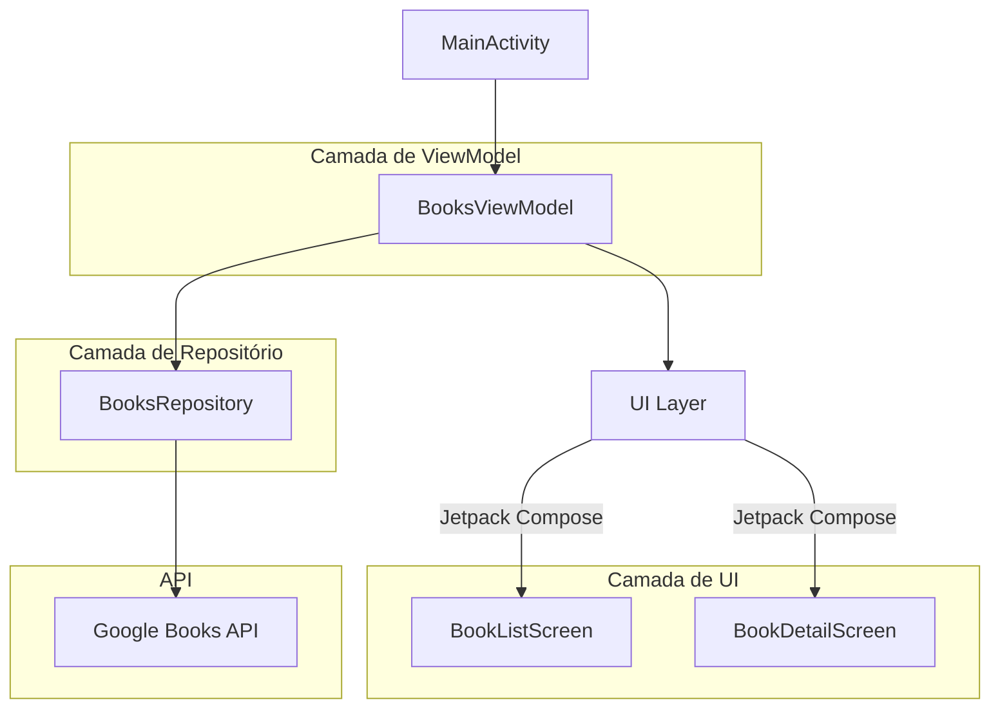

# 📚 Aplicativo Bookshelf

## 📑 Índice

- [Visão Geral](#-visão-geral)
- [Screenshot](#-screenshot)
- [Funcionalidades](#-funcionalidades)
- [Tecnologias Utilizadas](#-tecnologias-utilizadas)
- [Arquitetura](#-arquitetura)
- [Diagrama](#-Diagrama)

## 📝 Visão Geral

O **Bookshelf Application** é um aplicativo Android desenvolvido como parte de um desafio dos Google Developers para buscar e exibir informações sobre livros utilizando a API do Google Books. O aplicativo permite que os usuários pesquisem livros, visualizem os resultados em um layout de grade e acessem informações detalhadas sobre cada livro. Ele utiliza práticas e tecnologias modernas de desenvolvimento Android para proporcionar uma experiência de usuário fluida e responsiva.

## 📷 Screenshot

## 🚀 Funcionalidades

- **Buscar Livros:** Usuários podem inserir uma consulta para pesquisar livros.
- **Exibir Resultados:** Os resultados da pesquisa são exibidos em um layout de grade rolável, mostrando as capas dos livros.
- **Detalhes do Livro:** Ao tocar em um livro, o usuário é direcionado para uma visualização detalhada, exibindo título, subtítulo, autores, descrição e imagem da capa.
- **Tratamento de Erros:** Exibe mensagens de erro apropriadas e opções de tentativa novamente em caso de falhas de rede ou outros problemas.
- **Indicadores de Carregamento:** Mostra animações de carregamento enquanto os dados são buscados.

## 🛠️ Tecnologias Utilizadas

- **Kotlin:** Linguagem principal para desenvolvimento Android.
- **Jetpack Compose:** Toolkit moderno para construção de interfaces nativas.
- **Retrofit:** Cliente HTTP para interagir com a API do Google Books.
- **Coil:** Biblioteca de carregamento de imagens de forma assíncrona.
- **Material3:** Componentes mais recentes do Material Design para uma UI/UX consistente.
- **ViewModel:** Componentes conscientes do ciclo de vida para gerenciar dados relacionados à UI.
- **Navigation Compose:** Gerenciamento de navegação dentro do aplicativo de forma fluida.
- **Injeção de Dependências:** Gerenciada manualmente usando um padrão de container.
- **Coroutines:** Programação assíncrona para operações de rede.

## 🏛️ Arquitetura

O aplicativo segue uma abordagem de arquitetura limpa, separando as responsabilidades em diferentes camadas:

- **Camada de UI:** Funções Composable construídas com Jetpack Compose que tratam a lógica de apresentação.
- **Camada de ViewModel:** Gerencia os estados da UI e interage com o repositório para buscar dados.
- **Camada de Repositório:** Abstrai as fontes de dados; neste caso, busca dados da API do Google Books usando Retrofit.
- **Camada de Rede:** Define os endpoints da API e lida com as requisições de rede.

## 📊 Diagrama

---

Feito com ❤️ por [Murilo Luzzi](https://github.com/mlzzi)

